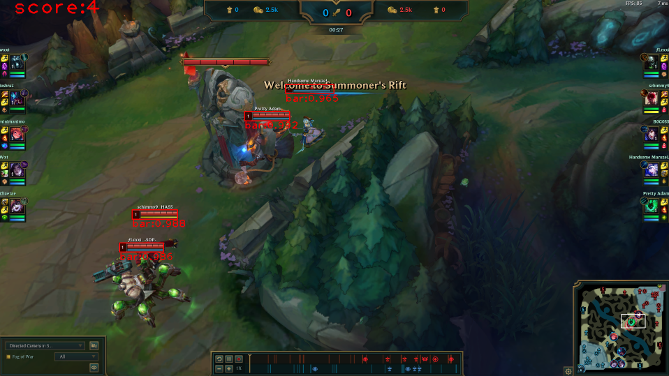

# League Vision Challenge

## Introduction

**Yolov4 artificial neural network, trained to detect and count the champions health bars on the League of Legends game image files.**

The ANN was created and trained with the help of the Darknet framework, using the Google Colaboratory.

In order to collect dataset, *jpg* images were extracted from gameplay videos with a frequency of 0.2 *fps*. Over 2100 images were collected.
Extraction of the images was realized using created script `extract_frames.py`.

Labels for the images were created manually, using LabelImg program. Example datasets are presented in the *example_datasets* folder.

## Run detection

To show every image from given directory with bounding boxes and total score, run `run_yolo_detection.py` script and enter images directory.
To print total amount of champions health bars on image, run `run_yolo_count.py`. Input images names as command line arguments e.g. `python run_yolo_count.py img1.jpg img2.jpg img3.jpg`

 

